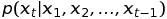
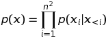
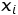
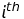
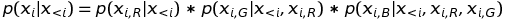
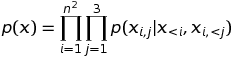
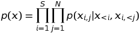
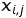

# EveNet: Expression of Emotion and Visimes Network

[](https://travis-ci.org/elggem/EveNet)

This is a fork of ibab's excellent implementation of WaveNet. Here we are implementing changes for the generation of facial animations.
## Exprements
### Network with softmax output layer
[Authors of wavenet stated](https://arxiv.org/abs/1609.03499) that modeling the conditional distribution:    

  

with softmax distribution tends to work better than some of previous modeling, such as mixture density network or mixture of conditional Gaussian scale mixtures. 

This approach models each shape key values of each frame to softmax probability distribution of 11 classes. The probability values are calculated with the method explained  [here](https://docs.google.com/document/d/1PTGRjHrIJsW_7Ypv6uc3etWj37sevNbXCcDpuH8S1b8/edit?ts=5bfd4948#bookmark=id.43gy6l9nzf80).

Here is [github branch](https://github.com/hansonrobotics/Evenet/tree/expermenting-with-softmax-layer) for this experment.


### Shape key sampling
This approach is variant of approach adopted in pixelcnn, to extend the dependencies among pixels to color channels. In [pixelrnn paper ](https://arxiv.org/abs/1601.06759) the author stated the joint probability for pixel sampling is  

,  

Where,  is  pixel.  
They also extend this pixel dependencies to color channels as follows:-



If we use indexes for color channels(assign 1 to R index, 2 to G index and 3 to B index), the joint probability p(x) now can be written as   
  

This type of joint probability can be applied to shape key sampling. Now the above joint probability can be rewritten for shape key sampling as  
  
where S is number of samples, N is number of shape keys in single frame,  is   frame and  is jth shape key of ith frame.


Code implementation  for this experment is found on [github branch](https://github.com/hansonrobotics/Evenet/tree/shape-key-sampling-with-softmax-layer).

## Requirements

TensorFlow needs to be installed before running the training script.
Code is tested on TensorFlow version 1.0.1 for Python 2.7 and Python 3.5.

In addition, [librosa](https://github.com/librosa/librosa) must be installed for reading and writing audio.

To install the required python packages, run
```bash
pip install -r requirements.txt
```

For GPU support, use
```bash
pip install -r requirements_gpu.txt
```

## Running tests

Install the test requirements
```
pip install -r requirements_test.txt
```

Run the test suite
```
./ci/test.sh
```

## Related projects

- [tensorflow-wavenet](https://github.com/ibab/tensorflow-wavenet), the WaveNet implementation this is based on.
